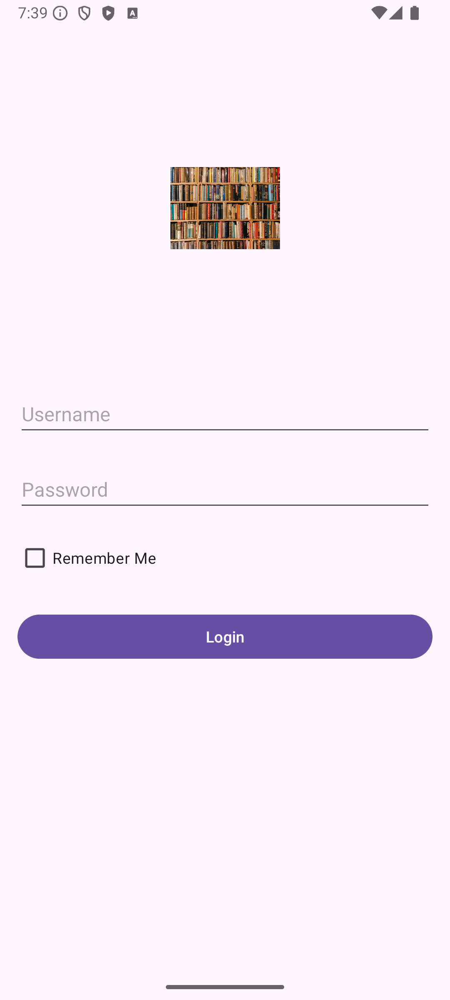
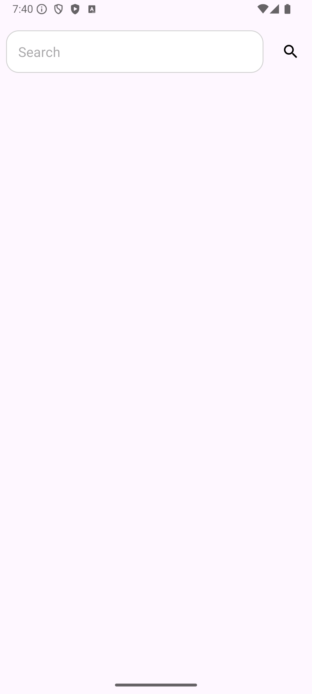
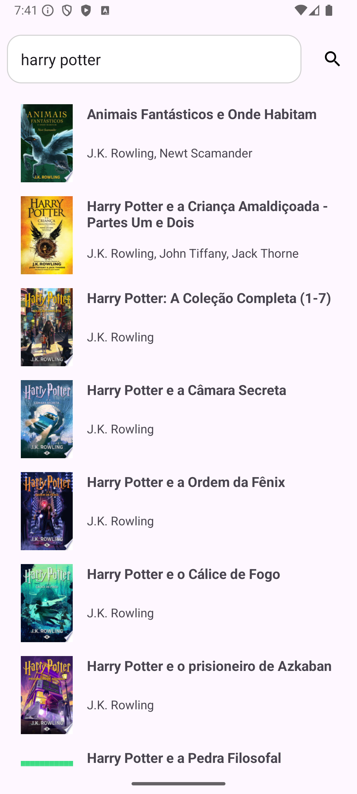
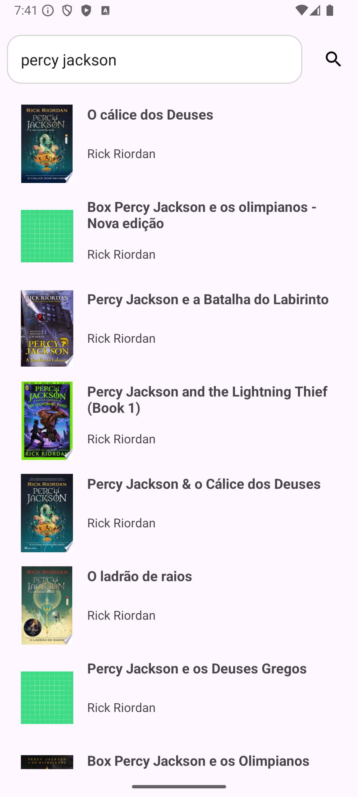

# MyPersonalLibrary

Welcome to My Personal Library! This project allows users to log in to their personal accounts, 
search for books using the Google Books API, and manage their reading lists. You can add books to lists such 
as "Read," "Currently Reading," and "Want to Read."

## Problem 

As an avid reader, I often struggle to keep track of all the books I’ve read,
those I’m currently reading, and those I plan to read in the future. This project aims to solve 
that problem by providing an organized and user-friendly way to manage personal reading lists.

## Project Architecture

This project is being developed using the **Model-View-ViewModel (MVVM)** architecture, which helps to separate concerns and make the code more modular, testable, and maintainable.
**Koin** was used for dependency injection, ensuring that dependencies are provided efficiently and making the codebase cleaner and easier to manage.
**Retrofit** was used for handling the API response. 

## Features
- **User Authentication**: Log in with your account to manage your personal library.
- **Search for Books**: Find books using the Google Books API.
- **Manage Reading Lists**: Organize books into "Read," "Currently Reading," and "Want to Read" lists.

## Current App Design

Currently, our app looks like this, but we are working to improve our prototype.

1. **Login Screen**

   

   - Users can enter their username and password, with an option to stay logged in for convenience using SharedPreference.

2. **Search Books**

   

   - After logging in, the user can search for books by title, author, or keyword.

3. **Book List**

   

   - A list of books retrieved from the Google Books API is displayed based on the user's search query.

4. **Second Book List**

   

  - Another view of the search results, displaying a list of books retrieved from the Google Books API.

## What's Next

- Database Integration: Implement a database to persist user book information.
- New Activities: Develop additional activities for enhanced user interaction.
- Layout Enhancements: Continue improving the app’s layout for a better user experience.
- Unit tests.
